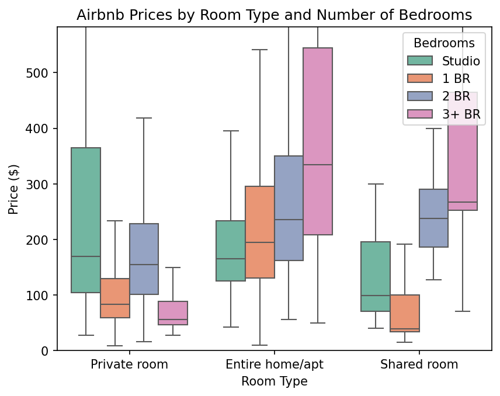
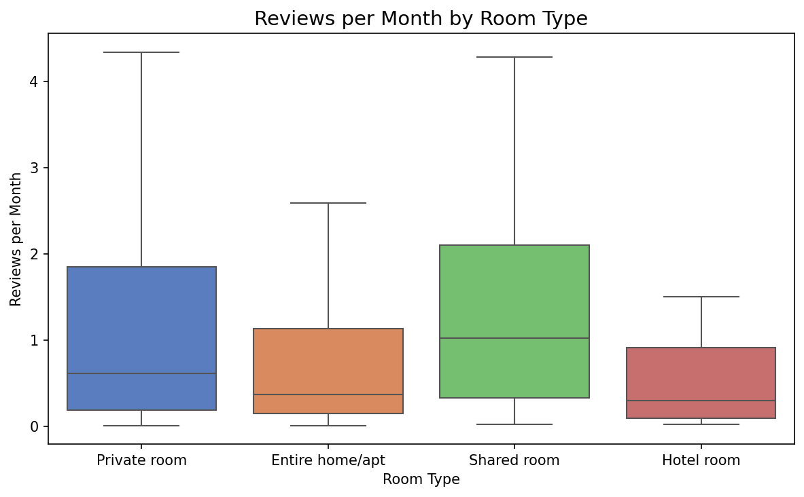
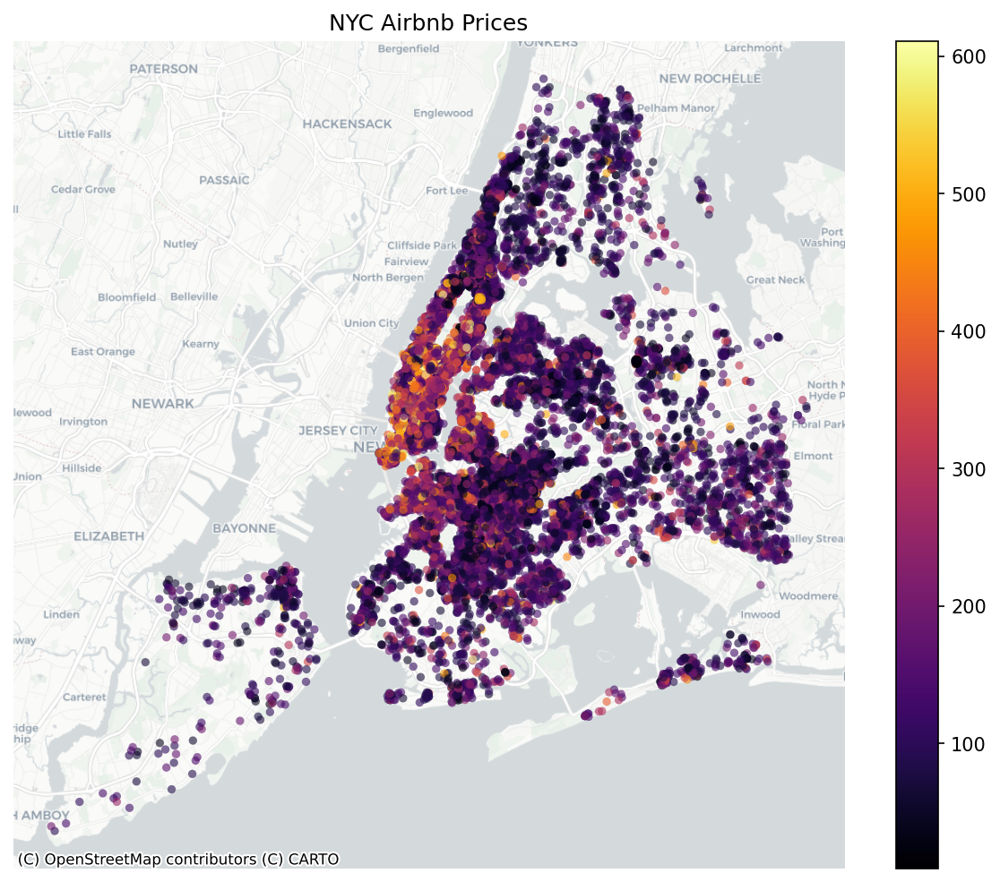
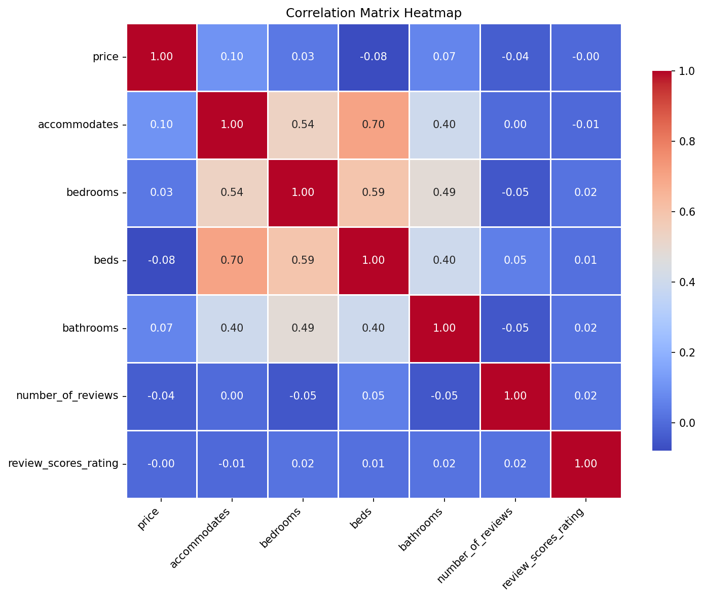

# STAT 486 Project Data and EDA Checkpoint

**Team Members:** Mitchell Heaton, Sammi Hilton, Ella Walker

---

## 1. Research Question and Dataset Overview

**Research Question:** What listing characteristics most strongly predict the nightly price of an Airbnb in November in New York City?

Our dataset is the NYC Airbnb listings file sourced from [Inside Airbnb](http://insideairbnb.com/get-the-data/), a public platform that scrapes and publishes Airbnb listing data for transparency and research purposes. The scrape used here was collected in November 2025 and contains 36,353 listings across New York City's five boroughs, with 79 columns covering host attributes, property details, availability, pricing, and guest reviews.

Inside Airbnb publishes data under a [Creative Commons CC0 1.0 Universal license](https://creativecommons.org/publicdomain/zero/1.0/), making it freely available for analysis. The dataset contains no personally identifiable information (PII) beyond publicly listed host names and profile photos, which are already visible on Airbnb's platform. No ethical concerns are present; we are using publicly available, anonymized listing data for academic purposes.

---

## 2. Data Description and Variables

**Key variables used in this analysis:**

- `price` *(target)*: Nightly listing price in USD. Parsed from a string format (e.g., `$120.00`) to a float.
- `room_type`: Categorical — one of "Entire home/apt," "Private room," and "Shared room,."
- `bedrooms`: Number of bedrooms in the listing (float; some missing values).
- `neighbourhood_group_cleansed`: Borough (Manhattan, Brooklyn, Queens, Bronx, Staten Island).
- `accommodates`: Number of guests the listing can host.
- `latitude` / `longitude`: Geographic coordinates used for spatial analysis.
- `reviews`: Ranging from 1-5, the number of reviews per month for a given listing.

**Preprocessing steps completed:**

- Stripped `$` and `,` from `price` and cast to float.
- Removed listings with missing `price` values (36,353 to 21,415 usable price observations).
- Applied a log transformation to `price` (`log_price`) to reduce right skew caused by extreme luxury listings.
- Filtered to the bottom 95th percentile of prices for spatial mapping to reduce distortion from outliers.
- Missing values in `bedrooms` and `bathrooms` were noted but not yet imputed; these columns are handled on a per-analysis basis.

---

## 3. Summary Statistics

### Price Distribution (n = 21,415)
The price variable exhibits significant right-skewness. While the **Median** nightly rate is **$154.00**, the **Mean** is pulled upward to **$519.62** by extreme outliers, including a maximum value of **$50,138.00**. 

| Statistic | Value (USD) |
| :--- | :--- |
| **Mean** | $519.62 |
| **Median** | $154.00 |
| **Std. Deviation** | $3,658.43 |
| **25th Percentile (Q1)** | $90.00 |
| **75th Percentile (Q3)** | $269.00 |
| **Range** | $9.00 – $50,138.00 |

> **Statistical Note:** The Standard Deviation ($3,658.43) is nearly 7x the Mean, confirming high volatility. Log-transformation or outlier capping (e.g., at the 95th or 99th percentile) is recommended for future regression modeling.

---

### Key Numerical Variables (n = 21,415)
| Variable | Mean | Std. Dev | Median | Max |
| :--- | :--- | :--- | :--- | :--- |
| **Accommodates** | 2.89 | 2.03 | 2.00 | 16.00 |
| **Bedrooms** | 1.35 | 0.97 | 1.00 | 16.00 |
| **Beds** | 1.63 | 1.22 | 1.00 | 40.00 |
| **Bathrooms** | 1.19 | 0.55 | 1.00 | 15.50 |
| **Review Rating** | 4.77 | 0.40 | 4.86 | 5.00 |

---

### Categorical Distributions

#### Room Type (n = 21,415)
Entire homes and apartments make up the majority of the dataset, followed closely by private rooms.

| Room Type | Count | Percentage |
| :--- | :--- | :--- |
| **Entire home/apt** | 12,441 | 58.1% |
| **Private room** | 8,604 | 40.2% |
| **Shared room** | 199 | 0.9% |
| **Hotel room** | 171 | 0.8% |

#### Borough Distribution (n = 21,415)
Manhattan and Brooklyn account for nearly 80% of all listings in the dataset.

| Borough | Listing Count | Percentage |
| :--- | :--- | :--- |
| **Manhattan** | 9,558 | 44.6% |
| **Brooklyn** | 7,313 | 34.1% |
| **Queens** | 3,412 | 15.9% |
| **Bronx** | 818 | 3.8% |
| **Staten Island** | 314 | 1.5% |

---

### Correlation Insights
The raw correlation between `price` and other variables is currently low (e.g., `accommodates` at **0.10**). This is likely due to the extreme price outliers masking linear relationships. Capacity variables (`beds`, `bedrooms`, and `accommodates`) show strong multi-collinearity, with correlations ranging from **0.54 to 0.70**.

---

## 4. Visual Exploration

### Figure 1: Price by Room Type and Number of Bedrooms

This visualization shows that Room Type is a primary driver of price variance, with "Entire home/apt" commanding a significant premium and showing the highest sensitivity to Bedroom Count. While 1-bedroom units show consistent pricing across the board, 3+ bedroom listings exhibit extreme volatility, suggesting that for larger units, other factors—such as specific neighborhood or luxury amenities—become more influential predictors than capacity alone. This confirms that our pricing model will likely need to account for interaction effects between room type and size.

---

### Figure 2: Reviews per Month by Room Type

Shared rooms show the highest variability in monthly reviews, while entire home/apt listings are the most consistent but tend to receive fewer reviews. Private and hotel rooms fall in between, with medians clustering below 1 review per month across all room types — suggesting that most listings, regardless of type, receive reviews relatively infrequently.

---

### Figure 3: Geographic Price Map of NYC

The map indicates that Airbnb prices in Manhattan are higher than in other areas of New York City. Listings are sparse on Staten Island and in the outer areas of Queens, suggesting that visitors tend to prefer more urban neighborhoods. Manhattan’s status as the most expensive borough is an important factor to consider in our analysis. The color scale represents price in dollars per night.

### Figure 4: Correlation Matrix Heatmep

The heatmap reveals strong multi-collinearity between accommodates, bedrooms, and beds ($r > 0.70$), indicating that these features provide overlapping information regarding listing capacity. Interestingly, the correlation between price and review_scores is negligible, suggesting that luxury pricing in NYC is driven by physical attributes and location rather than guest satisfaction ratings. The low linear correlation between price and individual predictors ($< 0.20$) highlights the necessity of the log-transformation and the use of non-linear models for the next phase of the project.

---

## 5. Challenges and Reflection

The most significant challenge so far has been dealing with the missingness in `price` — nearly 15,000 listings had no price listed, which is a substantial portion of the dataset. It's unclear whether these are inactive listings, pending approvals, or simply data gaps in the scrape. We chose to drop them for now, but this may introduce selection bias if inactive listings differ systematically from active ones.

We are also deciding how to handle `bedrooms` missingness (~6,000 missing values) before modeling. Simple imputation with the median is a likely approach, but we want to verify that missingness is random and not concentrated in a particular borough or room type before proceeding.

The last challenge we faced was that hotel prices were extremely skewed and may have been inaccurately recorded, reporting values $40,000 higher than the average prices, so we decided to drop `hotel` room type for now, to prevent dominating the model.

