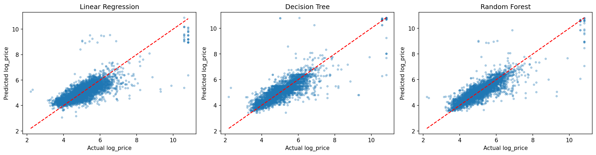
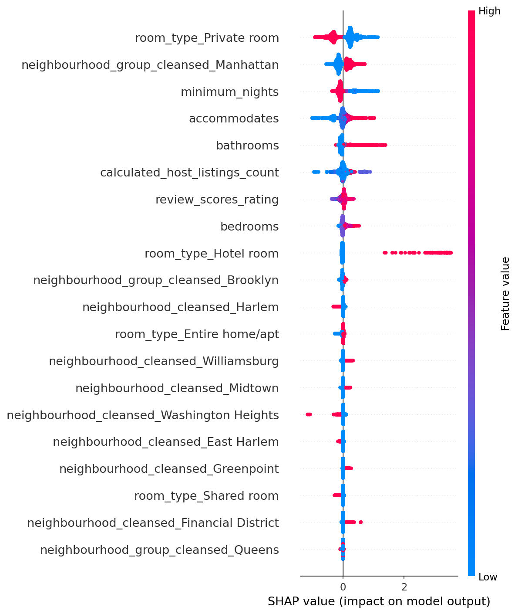

# STAT 486 Project: Supervised Modeling Checkpoint

**Team Members:** Mitchell Heaton, Sammi Hilton, Ella Walker

---

## 1. Problem Context and Research Question

This project aims to predict the nightly price of NYC Airbnb listings using supervised learning. Our central question is: which listing characteristics (such as location, room type, and physical attributes) best predict nightly price?

---

## 2. Supervised Models Implemented

We implemented three models: linear regression (baseline), decision tree regression, and random forest regression. The target variable is `log_price` (log-transformed nightly price), chosen to reduce right skew and improve model fit. Features include `bedrooms`, `bathrooms`, `accommodates`, `review_scores_rating`, `minimum_nights`, `calculated_host_listings_count`, `room_type`, `neighbourhood_group_cleansed`, and `neighbourhood_cleansed`.

All preprocessing (median imputation for numeric features, most-frequent imputation and one-hot encoding for categoricals, and standard scaling) was performed inside a `sklearn` Pipeline fitted only on training data, preventing data leakage. The dataset was split 80/20 into training (n = 17,132) and test (n = 4,283) sets. Decision tree and random forest hyperparameters were tuned using 5-fold GridSearchCV on the training set only.

| Model | Key Hyperparameters Tuned | Best Params | CV Strategy | Train RMSE | Test RMSE | Train R² | Test R² |
|---|---|---|---|---|---|---|---|
| Linear Regression | None | — | 5-fold CV (R² = 0.632 ± 0.023) | 0.539 | 0.572 | 0.643 | 0.617 |
| Decision Tree | `max_depth`, `min_samples_leaf` | depth=12, leaf=5 | 5-fold GridSearchCV | 0.406 | 0.495 | 0.798 | 0.713 |
| Random Forest | `n_estimators`, `max_depth`, `min_samples_leaf` | 100 trees, depth=None, leaf=5 | 5-fold GridSearchCV | 0.355 | 0.460 | 0.846 | 0.752 |

---

## 3. Model Comparison and Selection

All three models showed a consistent pattern: predictions clustered tightly around median prices while extreme high-price outliers were systematically underestimated, visible in the actual vs. predicted plots below. Random Forest performed best with a test R² of 0.752 and RMSE of 0.460, outperforming both the decision tree (R² = 0.713) and linear regression (R² = 0.617). Its advantage stems from averaging across many trees, which reduces variance and captures nonlinear feature interactions that linear regression cannot model.

The decision tree showed a noticeable train/test R² gap (0.798 vs. 0.713), indicating mild overfitting even with tuned depth. Random Forest mitigated this through averaging many predictions, with a smaller gap (0.846 vs. 0.752). While some overfitting is present across all three models, the test R² of 0.752 for Random Forest suggests the model generalizes well enough to support meaningful conclusions about which features drive NYC Airbnb pricing. Linear regression's weaker performance suggests that price relationships in this data are nonlinear, particularly the interaction between neighbourhood and room type.

---

## 4. Explainability and Interpretability

SHAP values were computed for the random forest model using `shap.TreeExplainer` to quantify each feature's contribution to individual predictions. The summary plot below ranks features by mean absolute SHAP value across the training set.

`room_type_Private room` and `neighbourhood_group_cleansed_Manhattan` are the two strongest predictors. Being a private room is associated with strongly negative SHAP values; this means that it consistently pushes predicted price down relative to entire home listings. Manhattan borough membership pushes prices up substantially. `minimum_nights`, `accommodates`, and `bathrooms` also contribute meaningfully, while review scores and host listing count have relatively weak influence. This confirms that location and listing type dominate price prediction, with physical size playing a secondary role.

---

## 5. Final Takeaways

Supervised modeling reveals that NYC Airbnb pricing is driven primarily by two factors: where a listing is located and what type of space it offers. Random Forest was the strongest model and is our selected approach going forward. The train/test gaps across all models suggest some remaining variance that additional features, such as `proximity to transit` or `amenity counts`, could help explain. These results directly address our research question by identifying room type and neighbourhood as the most important pricing signals, with ensemble methods best suited to capture their nonlinear interactions.