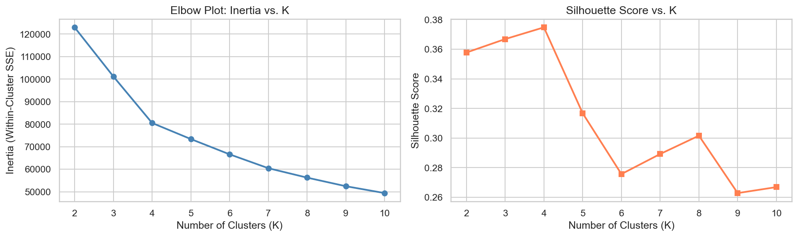
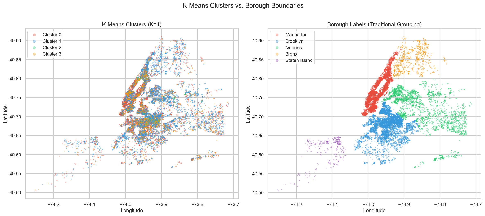
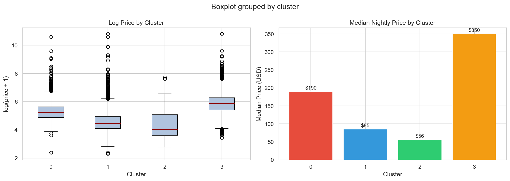

# STAT 486 Project: Unsupervised Learning Checkpoint

## Additional Method: K-Means Clustering

We applied K-Means clustering to identify latent structure in the Airbnb listings dataset. Features included latitude, longitude, accommodates, bedrooms, bathrooms, and one-hot encoded room type. All features were standardized prior to clustering. We evaluated K values from 2 to 10 using inertia (elbow method) and silhouette scores, selecting **K = 4** as the optimal balance between separation and interpretability.

## New Insight Beyond Supervised Analysis

We initially expected clusters to align with **boroughs (geographic regions)**. However, visual comparison shows that K-Means clusters do not match borough boundaries well.

Instead, clusters align strongly with **room type and price tiers**, revealing meaningful market segments:

- Cluster 1: Low-cost private rooms (median ≈ $85)
- Cluster 0: Mid-range entire homes (median ≈ $190)
- Cluster 3: Large, high-end listings (median ≈ $350)
- Cluster 2: Small shared/low-demand listings

This indicates that **listing characteristics (room type, size, capacity)** are more important than location alone in defining pricing structure. Clustering uncovered natural groupings such as budget, standard, and premium listings.

## Connection to Supervised Results

Clustering did not significantly improve predictive performance. A global Random Forest achieved RMSE = 0.4433, compared to RMSE = 0.4405 for per-cluster models (+0.0028 improvement).

However, clustering reinforces the supervised model’s findings. The same key variables: room type, property size, and location drive both prediction and cluster formation. This consistency validates that the supervised model is capturing real underlying structure.

## Final Conclusion

K-Means clustering did not meaningfully improve model accuracy but provided valuable insight into the structure of the dataset. The clusters reveal distinct market segments driven primarily by listing characteristics rather than geography. This demonstrates how unsupervised learning complements supervised models by improving interpretability and uncovering hidden patterns.